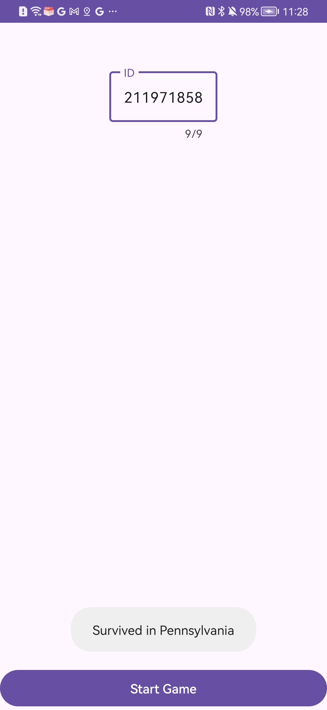

# 🧠 Survive Game – Reverse Engineering Project

This project is part of a reverse engineering assignment.  
The goal was to analyze an Android game application provided only as an APK file, understand its internal logic, fix compilation and runtime errors, and successfully run the game according to the logic implemented in the original code.

The final result is a fully runnable Android Studio project with fixed code, restored resources, and documented behavior.

---

## 🔧 Work Process

### 1. APK Decompilation

- Received a compiled APK file  
- Performed decompilation using reverse-engineering tools  
- Extracted:
  - Java source files
  - XML layout files
  - AndroidManifest.xml
  - Drawable and string resources

---

### 2. Import Into Android Studio

A **new clean Android Studio project** was created.  
The following files were manually imported:

- AndroidManifest.xml  
- Activity_Menu.java  
- Activity_Game.java  
- activity_menu.xml  
- activity_game.xml  
- Drawable resources  

---

## 🛠️ AndroidManifest.xml Fixes

| Problem | Solution |
|------|--------|
| platformBuildVersionCode / platformBuildVersionName | Removed – invalid in source projects |
| compileSdkVersion inside manifest | Removed – must be defined in Gradle |
| Missing android:exported="true" | Added to activities with intent-filter |
| appComponentFactory requiring API 28+ | Removed to avoid unnecessary minSdk requirements |
| Package name mismatch | Updated to com.classy.survivegame |

---

## 🐞 Code Fixes and Improvements

### Activity_Menu.java

- Fixed broken URL caused by zero-width invisible characters  
- Moved UI operations to runOnUiThread  
- Added ID length validation (must be 9 digits)  
- Added bounds check when selecting the state  

### Activity_Game.java

- Replaced hardcoded Toast duration with Toast constants  
- Ensured game logic only runs with valid ID input  

---

## 🕹️ How the Game Works

### Activity_Menu

- User enters a 9-digit ID  
- App fetches a list of U.S. states from a remote server  
- The 7th digit of the ID (charAt(7)) selects the state  

---

### Activity_Game

- Four arrow buttons are displayed: ⬅️ ➡️ ⬆️ ⬇️  
- Each digit in the ID determines a move:

digit % 4 → direction

| Result | Direction |
|------|----------|
| 0 | Left |
| 1 | Right |
| 2 | Up |
| 3 | Down |

- Correct sequence → Survived  
- Incorrect sequence → Failed  

---

## 🔎 Example

**ID:** 211971858  

**Button sequence:**  
⬆️ ➡️ ➡️ ➡️ ⬇️ ➡️ ⬅️ ➡️ ⬅️  

**Result:**  
The screenshot below shows the successful completion of the game
using ID **211971858**, resulting in the message:

**"Survived in Pennsylvania"**

  

---

## ✅ Final Result

- Project builds and runs successfully  
- All bugs were fixed  
- Game logic fully understood and documented  
- Correct success message displayed  

---

